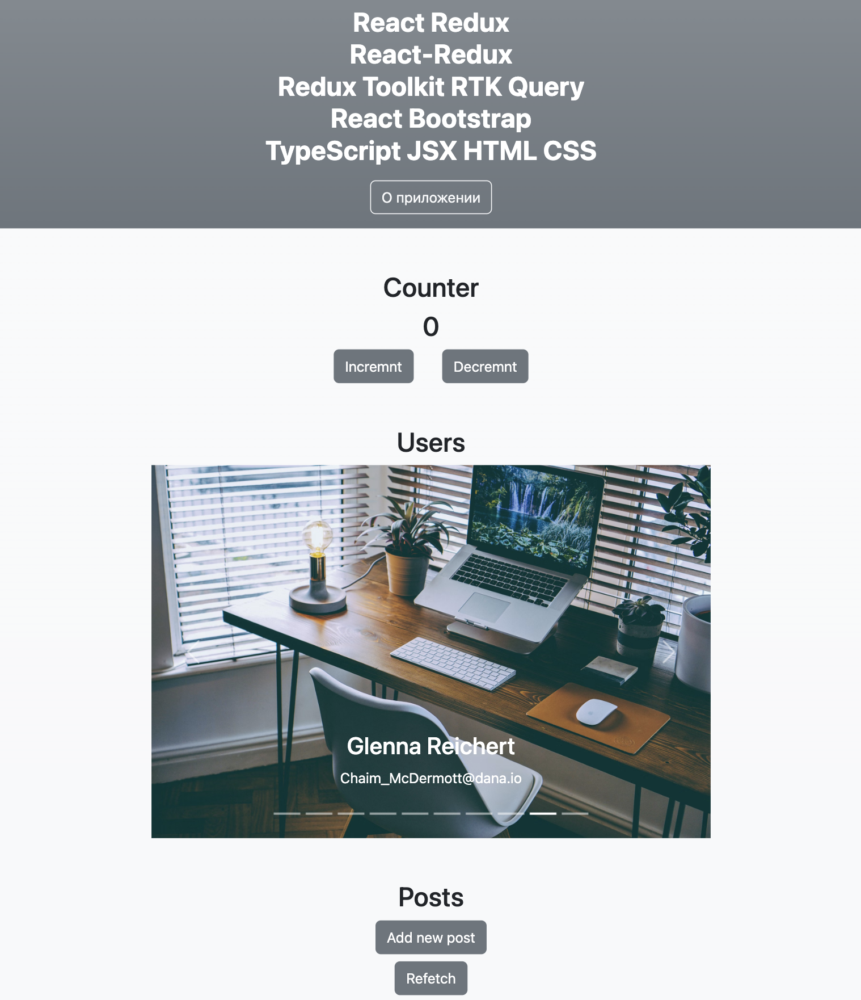

# React, Redux, Redux Toolkit и RTK Query

#### Данное приложение реализовано на языке Type Script с помощью JavaScript-библиотеки – React, с использованием стейт менеджера Redux, Redux Toolkit и RTK Query.

          
<b>#</b> В ходе работы создан стор&#40;<b>store</b>&#41; с помощью
импортированной функции <b>configureStore</b> из <b>ReduxToolkit</b>.
Создан корневой редьюсер&#40;rootReducer&#41;, а также типы для
взаимодействия с хранилищем: тип состояния&#40;RootState&#41;, тип
стора&#40;AppStore&#41; и тип диспатча&#40;AppDispatch&#41;. Для
работы с <b>Redux</b> создано два кастомных хука: useAppDispatch и
useAppSelector. Для создания редьюсера типизировали состояние
UserState, определили какие поля и какого типа будут храниться в
состоянии. Создали слайс userSlice с помощью функции
<b>createSlice</b> с опциями. В опции <b>reducers</b> создали две
функции для изменения состояния счетчика.
 
 
<b>#</b> Получения списка пользователей с сервера является асинхронным
процессом. <b>ReduxToolkit</b> включает в себя работу с
<b>middleware</b> библиотекой <b>ReduxThunk</b>. Данные получаем от
сервиса <b>JsonPlaceholder</b>. Импортировали функцию
<b>createAsyncThunk</b> для создания асинхронного экшен
генератора&#40;<b>action creator</b>&#41;, в котором с помощью
библиотеки <b>axios</b> отправляем запрос по определенному <b>url</b>,
в случае успешной загрузки возвращаем данные о пользователях в формате
<b>json</b>, в случае ошибки возвращаем ошибку. В опции
<b>extraReducers</b> функции <b>createSlice</b> описаны три сценария
для изменения данных: <b>fulfilled</b> – успешная загрузка,
<b>pending</b> – ожидание, <b>rejected</b> – ошибка. Список пользователей 
отрисовывается в зависимости от значения
полей&#40;isLoading, error&#41; в состоянии UserState.
 
 
<b>#</b> Для работы с <b>RTK Query</b> реализован функционал для
получения и изменения данных о постах с сервера. Для начала установили
<b>json-server</b>, с помощью которого получаем <b>REST API</b> без
предварительной настройки. Данные будут храниться в файле в формате
<b>json</b>. Для описания сервиса, который отвечает за изменение и
получения данных о постах создаем postAPI с помощью функции
<b>createApi</b>. При вызове функции передали ряд опций: уникальный
ключ, который будет определять текущий сервис&#40;<b>reducerPath</b>
&#41;; опцию <b>baseQuery</b>, в которую передали функцию
<b>fetchBaseQuery</b> с опцией базового <b>url</b>, на который этот
сервис будет отправлять запросы; опцию <b>endpoints</b>, в которой
создали стрелочную функцию, которая возвращает объект со всеми
описанными эндпоинтами, на которые отправляются запросы. В
объекте, как ключ указали название метода, а в значение передаем
результат вывода <b>query</b> или <b>mutation</b>. В объекте описано
четыре метода: получение всех постов&#40;fetchAllPosts&#41;,
добавление поста&#40;createPost&#41;, изменение
поста&#40;updatePost&#41; и удаление поста&#40;deletePost&#41;. В
корневой редьюсер добавляем postAPI редьюсер, с помощью уникального
ключа <b>reducerPath</b>. В конфигурацию стора в поле
<b>middleware</b> добавляем middleware postAPI, с помощью стрелочной
функции, которая принимает функцию <b>getDefaultMiddleware</b>.
Благодаря функции <b>getDefaultMiddleware</b> получаем дефолтный
middleware, который уже подключён к ReduxTollkit и с помощью функции
concat добавляем middleware, который получаем из postAPI. При
отрисовке постов и функционала для них в компоненте пользуемся авто
сгенерированными хуками из postAPI&#40;useFetchAllPostsQuery – для
получения данных о постах, индикатора загрузки, индикатора ошибки и
функции <b>refetch</b>, для обновления всех постов,
useCreatePostMutation – для получения функции создания постов,
useDeletePostMutation – для получения функции удаления постов,
useUpdatePostMutation – для получения функции изменения поста&#41;.
 
 
<b>Вывод</b>: Использование библиотеки <b>Redux Toolkit</b> помогает
быстро начать использовать <b>Redux</b>, упрощает работу с типичными
задачами и кодом <b>Redux</b>. Данные средства позволяют не только
сделать процесс разработки более удобным, понятным и быстрым, но и
более эффективным, за счет наличия в библиотеке ряда хорошо
зарекомендовавших себя ранее инструментов. Использование
<b>RTK Query</b> упрощает распространенные случаи загрузки данных в
веб-приложении, избавляя от необходимости вручную писать логику
загрузки и кэширования данных. Позволяет решить проблему дедубликации
запросов, поддерживает кэширование при установке с настройками по
умолчанию, автоматически создает хуки, исходя из заданных эндпоинтов –
содержит полезные утилиты, позволяющие упростить написание кода.

#### _screenshot(1)_

#### _screenshot(2)_

### `npm start`

Runs the app in the development mode.
Open [http://localhost:3000](http://localhost:3000) to view it in your browser.